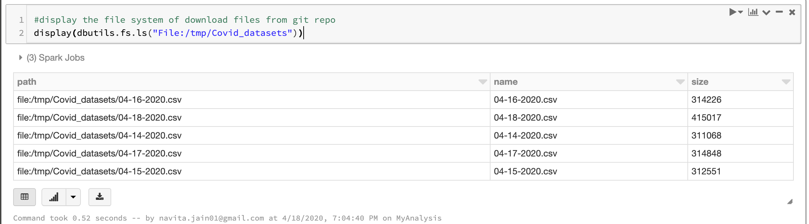
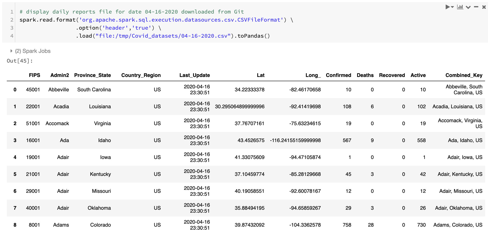
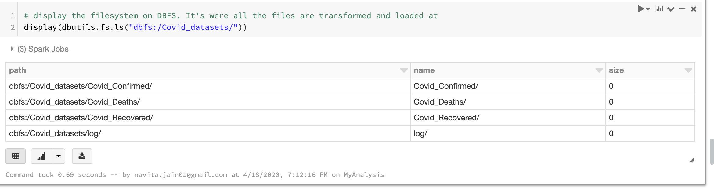
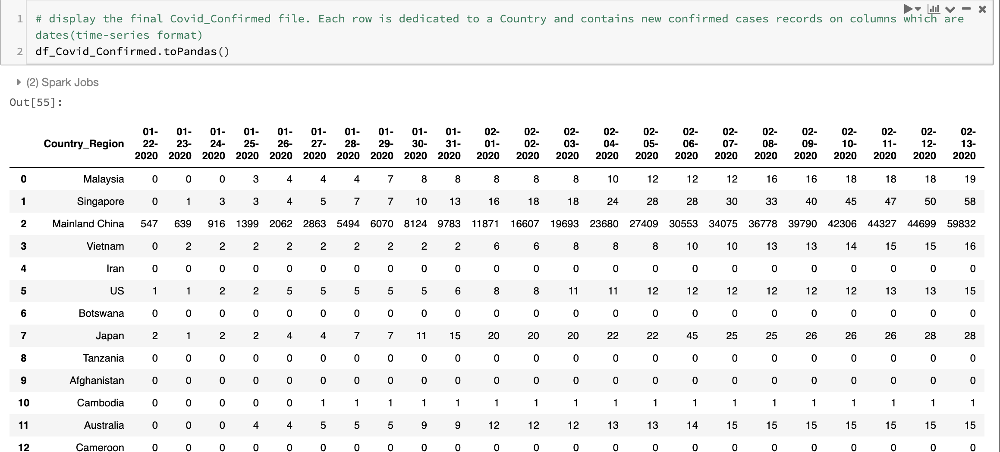

# Covid19 Data Pipeline on Databricks
Data Pipeline of Covid19 on Databricks  

Creating a Data Pipeline for Covid data from a git repository of  were Covid19 cases are daily reported. The current pipeline is created in Databricks and transformed data is loaded in DBFS file system. The pipeline is build in a community version of Databricks thus 1master and 1worker node. 

The daily reports file are downloaded in batches from Git repo to a local file system in databricks - 
 

Each daily records file from Git contains data like - 

The ETL pipeline loads data in Delta format into three category files Confirmed, Deaths, Recovered cases in the DBFS filesystem and a csv log file that works as a transaction log. Below is a view of DBFS filesystem where data is loaded in different category files- 

The use of Delta Lake made merging the new column/schema super easy, as the data is stored in a time-series fashion (@columns are dates). So, each day a new column is merged into existing delta table. Below is snapshot of the Covid Confirmed data

We also perform some basic analysis on this dataset.

### Next steps - 
Is to build a scalable and robust Pipeline using DELTA LAKE's BATCH Streaming. The current challenge with this pipeline is that mergeSchema appends rows to the table instead of extending existing rows. A customized solution is implemented that aggregates the ids and sums the columns. Thus, the plan is to use Delta lake's batch streaming readStream and writeStream API call's to address this.

